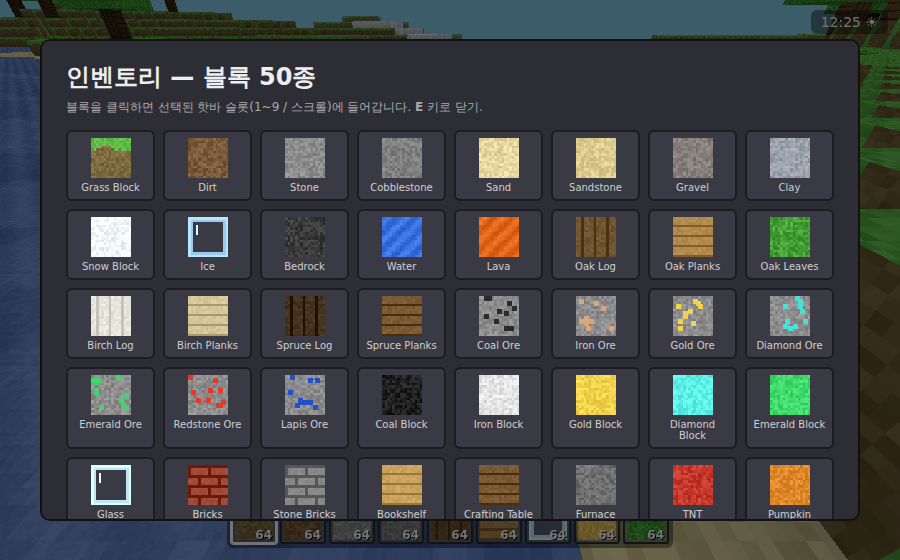

# ⛏️ Claude Minecraft — 서바이벌 모드

브라우저에서 바로 실행되는 마인크래프트 스타일 복셀 게임입니다.
**서바이벌 모드**와 **50종의 블록**이 구현되어 있으며, 외부 이미지/라이브러리 없이
순수 자바스크립트 + [three.js](https://threejs.org/)(로컬 번들 포함)로 만들어졌습니다.



## ✨ 주요 기능

### 서바이벌 시스템
- ❤️ **체력 / 🍖 허기 / 🫧 산소** 게이지
- 허기가 충분하면 체력 자동 회복, 허기가 0이면 굶주림 피해
- 💥 **낙하 데미지**, 🌊 **물속 익사**(산소 소진 시), 💀 **사망/리스폰**
- 달리기·점프 등 활동에 따른 허기 소모(피로도 시스템)
- 🍎 음식 섭취(호박/멜론/버섯)로 허기 회복

### 월드
- 무한 청크 기반 절차적 지형 생성 (Perlin 노이즈 + fBm)
- 🏜️ 사막 / 🌲 일반 / ❄️ 설원 **바이옴**, 산악 지형
- 🌊 바다와 수면, 🌳 나무(참나무/자작나무/가문비), 🌵 선인장
- ⛏️ 깊이별 **광물 분포**(석탄·철·금·다이아·에메랄드·레드스톤·청금석)
- 🕳️ 동굴 생성, 베드락 바닥
- ☀️🌙 **낮/밤 사이클**(시간에 따라 밝기·하늘색 변화)

### 블록 (총 50종)
흙·잔디·돌·자갈·모래·사암·점토·눈·얼음·기반암, 물·용암,
원목 3종·판자 3종·나뭇잎, 광석 7종·광물 블록 5종,
유리·벽돌·석재벽돌·책장·제작대·화로·TNT·호박·멜론·선인장·버섯·이끼낀 자갈·흑요석·네더랙·발광석·양털 등.
각 블록은 **절차적으로 생성된 16×16 텍스처 아틀라스**를 사용합니다.

## 🎮 조작법

| 입력 | 동작 |
|------|------|
| `W A S D` | 이동 |
| `Space` | 점프 / 수영(상승) |
| `Shift` | 달리기 |
| 마우스 | 시점 이동 |
| 좌클릭 (홀드) | 블록 채굴(경도에 따라 시간 소요) |
| 우클릭 | 블록 설치 |
| `1`~`9` / 마우스 휠 | 핫바 슬롯 선택 |
| `E` | 인벤토리 열기/닫기 (50종 전체) |
| `R` | 음식 먹기 |
| `F` | 비행 토글 |

## 🚀 실행 방법

ES 모듈을 사용하므로 로컬 웹서버가 필요합니다.

```bash
# 저장소 폴더에서
python3 -m http.server 8000
# 또는
npx serve .
```

브라우저에서 `http://localhost:8000/` 접속 → **게임 시작** 클릭.

> three.js는 `vendor/three.module.js`로 함께 포함되어 있어 인터넷 연결 없이도 동작합니다.

## 📁 구조

```
index.html        진입점 + UI 마크업 + importmap
styles.css        HUD / 인벤토리 / 메뉴 스타일
vendor/
  three.module.js  three.js r160 (로컬 번들)
src/
  main.js         게임 루프, 채굴/설치, HUD, 낮/밤, 인벤토리
  world.js        청크 생성, 지형/바이옴/나무/광물, 메시 생성(AO 포함)
  blocks.js       50종 블록 정의 및 속성
  textures.js     절차적 텍스처 아틀라스 생성
  player.js       이동/충돌/카메라/복셀 레이캐스트
  survival.js     체력/허기/산소/인벤토리 상태
  noise.js        Perlin 노이즈 + 시드 RNG
```

즐겁게 플레이하세요! 🎉
